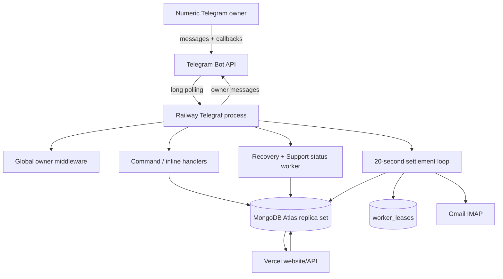
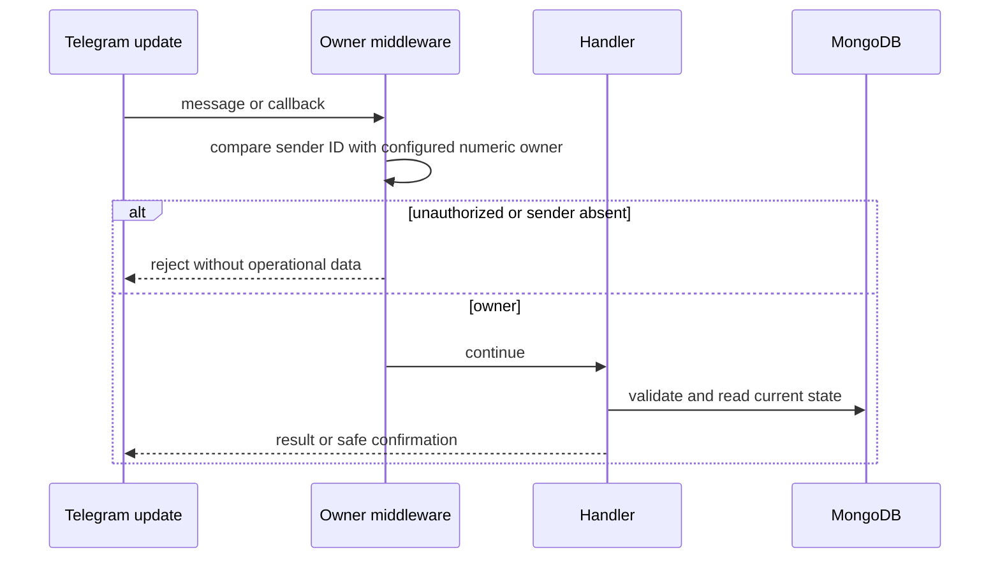
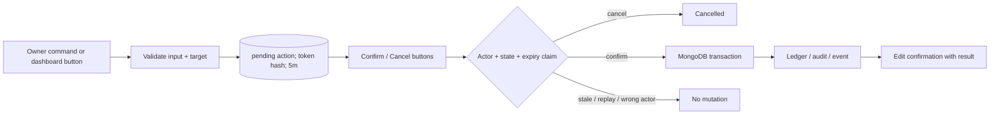
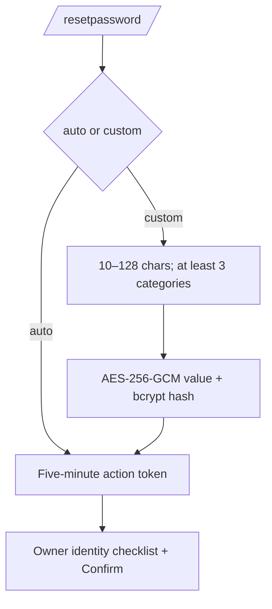

# SMM UP Admin Bot — Implemented-State Specification and Evolution Plan

> **Reconciled against:** `bot.ts`, `src/**/*.ts`, `tests/adminActions.integration.ts` and `tests/dashboardUi.ts`
> **Baseline before button-dashboard work:** `134bbcc5f19d535b8217549df641a0d831f23422` on `origin/master`
> **Earlier module-split reference:** `2c60e657c5759f7a22cf9fbb872e1d1e051e7201` on `improvement/private-repo-and-bot-modules`; Railway deployment is not yet proven
> **Updated:** 2026-10-07
> **Runtime decision:** Railway long-polling bot plus IMAP worker
> **Administration decision:** no website admin panel

This document replaces the old future-only plan. It distinguishes current source behavior from staging gates and optional later improvements. The implemented command and deployment registry is maintained in [`README.md`](README.md).

---

## 1. Mission and non-goals

The service gives the numeric Telegram owner audited operational control over:

- user/account/security state;
- revocable website sessions;
- password-recovery issuance;
- read-only Support Access;
- wallet corrections and order refunds;
- order/deposit/ledger inspection;
- named API-key administrative state;
- purchase-verified review moderation;
- Direct UPI email settlement and reconciliation;
- worker health and owner alerts.

It is not:

- a public customer bot;
- an MTProto user client;
- a Telegram webhook consumer;
- a website admin panel;
- a supplier-secret viewer;
- a password/API-secret retrieval system;
- a generic MongoDB console;
- an autonomous financial-decision system.

---

## 2. Implementation status

### Implemented and locally tested

- Numeric owner middleware on every update.
- Long polling with messages/callback queries only.
- Startup bot-identity lookup and pending-update drop.
- Paginated owner-only inline dashboard with Back/Home/Refresh navigation, per-chat text-entry wizards, and inline user-detail actions; all slash commands remain available.
- Telegram's bot command menu is synchronized at startup with the dashboard and existing commands.
- Callback keyboard helpers enforce Telegram's 64-byte callback-data and 64-character button-label limits.
- Five-minute hash-only generic mutation confirmations.
- Transactional credit, debit and full refund.
- Account lock/unlock and ordering/payment holds.
- API-key pause, resume, archive and reissue-required.
- User/order/deposit/wallet/security/note inspection.
- Revocable-session inspection, one-session revoke and global revoke.
- Generated or owner-selected temporary passwords.
- Temporary-password status synchronization.
- One-time Support Access codes and status synchronization.
- Review hide/restore in Telegram.
- Exact Direct UPI pending-payment settlement through IMAP.
- Distributed worker lease, health record, retries and reconciliation alerts.
- Replica-set integration coverage for concurrent mutations and settlement.

### Implemented but requiring staging/production proof

- Telegram owner identity and account security.
- Railway long-polling stability.
- Gmail/FamApp sender/content assumptions.
- Two-replica lease takeover behavior on Railway.
- Telegram edit/retry behavior under real API failures.
- Production Atlas indexes and transaction behavior.
- Production settlement/accounting reconciliation.

### Not implemented as a full product surface

- Durable/restart-safe wizard state across bot restarts or multiple replicas; dashboard text-entry state is bounded process memory with a 10-minute idle expiry.
- Multi-admin roles or two-person approvals.
- Provider-order retry/refill/cancel controls.
- Service override/maintenance management.
- Database-managed pricing/markup changes.
- Formal metrics dashboard or external alert sink.
- Bulk export.

`/start`, `/help` and `/menu` open the navigable button dashboard. It does not remove or replace slash commands; button-started workflows collect dynamic values with bounded prompts and reuse the existing mutation/recovery safeguards.

---

## 3. Runtime architecture



One process hosts all responsibilities today. MongoDB—not process memory—is authoritative for confirmation tokens, sessions, recovery credentials, Support Access, financial records, worker leases and health.

### Internal module boundaries

The source is modular without changing the deployment topology:

```text
bot.ts
├── config + MongoDB lifecycle/index gate
├── global numeric-owner middleware
├── generic confirmation callbacks
├── command registrars
│   ├── dashboard/navigation + text-entry wizards
│   ├── general/stats/reviews
│   ├── users/sessions/controls
│   ├── recovery/Support Access
│   └── wallet/order/deposit operations
└── worker runtime
    ├── IMAP scan/lease/reconciliation/health
    ├── temporary-password/Support Access status sync
    └── exactly-once settlement transaction
```

- `bot.ts` owns composition, launch and shutdown only, and keeps compatibility re-exports for the integration suite.
- `src/config.ts`, `src/db/client.ts` and `src/db/indexes.ts` isolate environment and persistence lifecycle concerns.
- `src/security/`, `src/domain/` and `src/ui/` contain reusable security, transactional, recovery-action and dashboard/review rendering logic.
- `src/commands/dashboard.ts` owns inline screen routing and bounded ephemeral text wizards; `src/ui/adminDashboard.ts` owns callback-safe navigation/keyboard helpers.
- `src/middleware/`, `src/callbacks/` and `src/commands/` register the Telegram interface in the established order.
- `src/worker/runtime.ts` composes focused payment and recovery-status workers.
- `src/worker/paymentScanner.ts` owns IMAP parsing and matching; `src/worker/paymentRuntime.ts` owns `/scan`, leasing, reconciliation, health and scheduling.
- `src/worker/recoveryStatus.ts` owns temporary-password and Support Access Telegram status synchronization; `src/worker/settlement.ts` owns the independently tested transaction.

These boundaries must not be deployed as separate services without a separately reviewed architecture change. The intended runtime remains one Telegraf long-polling process with the recurring workers colocated on Railway.

---

## 4. Trust boundaries and threats

### Trusted only after verification

- the exact `TELEGRAM_OWNER_ID`;
- the Telegram bot identity returned by `getMe`;
- Railway secret storage/runtime;
- the scoped MongoDB account and transaction-capable cluster;
- Gmail TLS connection and configured sender search;
- unique indexes and transaction semantics.

### Always untrusted

- callback data;
- owner-typed email, amount, reason, order ID, key ID and temporary value;
- Telegram username/chat metadata;
- MongoDB user/review/order/service fields;
- email subject/body and parsed memo/amount/UTR/TxID;
- provider errors;
- stale UI/message state.

### Primary threats and controls

| Threat | Current control |
|---|---|
| Non-owner command/callback | global numeric owner middleware |
| Username takeover | usernames never authorize |
| Old queued Telegram action | pending updates dropped at launch |
| Forged/replayed confirmation | SHA-256 token hash, actor binding, expiry, atomic state transition |
| State changed after preview | mutation re-reads state in transaction |
| Double credit/refund | unique settlement key plus transaction/conditional mutation |
| Negative wallet | amount validation and atomic balance floor |
| Raw secret exfiltration | secrets excluded from commands/audits; key controls mutate metadata only |
| Password recovery abuse | identity-check attestation, protected confirmation, bcrypt, restricted session |
| Unsafe impersonation | one-time Support Access, separate cookie/session, actor/subject, read-only API enforcement |
| Duplicate worker settlement | process guard, distributed lease, unique keys, MongoDB transaction |
| Email mismatch | trusted sender search, exact memo, exact amount, pending state and expiry |
| Worker ambiguity/failure | reconciliation record and owner alerts; no guessed credit |

Residual release gate: audit and standardize HTML escaping/sanitized owner-facing errors across all legacy list/error paths. New output must use the escaping helper; stored strings remain untrusted even in an owner-only chat.

---

## 5. Authorization lifecycle



Requirements:

- Do not authorize with Telegram username.
- Do not authorize with chat ID alone.
- Do not accept anonymous/channel identity as owner.
- Every callback passes the same middleware as commands.
- Owner Telegram two-step verification, device security and active-session review are operational prerequisites.

---

## 6. Interface model

### Inline dashboard and command input

`/start`, `/help` and `/menu` open the owner-only dashboard. Its sections cover Overview; paginated Users/search and user records; recent and failed Orders; Payments, deposits, memo lookup and reconciliation; Security, account controls and sessions; Reviews; and Worker health/manual scan. User profiles expose the implemented sessions, recovery/Support Access, controls, API-key, wallet and record actions.

Dynamic lists use bounded pagination. Data screens provide a parent Back path, Dashboard/Home path and Refresh action. Action forms prompt for arbitrary values (email, amount, reason, receipt IDs or optional custom password) rather than encoding them in callback data. `/cancel` and the wizard's Cancel button discard a form without staging an action. Wizard state is process-local, bounded and expires after 10 minutes of inactivity; it is not durable across restarts or shared between replicas.

All existing slash commands remain registered and listed in Telegram's command menu. They can still be used directly, with their existing validation and reason syntax:

```text
/<command> arguments | reason
```

The generic parser requires a reason between 5 and 500 characters. Recovery has its own validation and identity-checklist prompt. Starting another dashboard navigation action or a non-cancel slash command disarms any stale text wizard so unrelated text cannot be consumed by an earlier prompt.

### Confirmation UX



Generic actions are limited to 20 newly pending records per owner per five-minute window.

---

## 7. Command contract

### Read commands

| Command | Fixed behavior |
|---|---|
| `/stats` | user/order/paid-deposit counts and aggregate balances/spend |
| `/user <email>` | account, balance, API-key count, dates and inline controls |
| `/userorders <email>` | newest 10 user orders |
| `/deposits <email>` | newest 15 user transactions |
| `/wallet <email>` | newest 20 wallet entries |
| `/events <email>` | newest 15 security events + 10 notes |
| `/orders [limit]` | newest orders, default 5/max 20 |
| `/failed` | newest 10 failed/review-required orders |
| `/pending` | newest 10 pending deposits |
| `/checkmemo <memo>` | exact normalized memo lookup |
| `/settleupi <memo> <amount> <UTR> <TxID> \| reason` | owner-confirmed atomic recovery for a trusted legacy receipt whose provider removed SUP |
| `/reviews [limit]` | buyer reviews, default 8/max 12 |

`/userorders`, `/deposits`, `/wallet` and `/events` do not currently implement the optional limit previously described by stale documentation.

### Confirmed generic mutations

| Command | Action type | Transactional effects |
|---|---|---|
| `/credit` | `wallet_credit` | user balance + ledger + transaction + audit |
| `/debit` | `wallet_debit` | guarded balance - ledger + transaction + audit |
| `/refund` | `order_refund` | unique ledger + order refunded + balance/stat correction + transaction + audit |
| `/lock` | `account_lock` | flag + session/restricted-session revocation + security event + audit |
| `/unlock` | `account_unlock` | flag/reason/timestamps + event + audit |
| `/orderhold` | `ordering_hold` | ordering flag + event + audit |
| `/orderrelease` | `ordering_release` | clear flag + event + audit |
| `/paymenthold` | `payment_hold` | deposit flag + event + audit |
| `/paymentrelease` | `payment_release` | clear flag + event + audit |
| `/keypause` | `api_pause` | key paused + key/admin audit |
| `/keyresume` | `api_resume` | key active unless reissue remains required |
| `/keyarchive` | `api_archive` | identity archived + active versions revoked |
| `/keyreissue` | `api_reissue_required` | identity paused/reissue flag + versions revoked |

All amounts are converted to integer paise before mutation. Raw key secrets are not part of any bot operation.

### Immediate mutation

`/note <email> | <note>` inserts an owner note and audit record after validation but does not use Confirm/Cancel. Treat notes as operational records, not a place for credentials or unnecessary personal data.

---

## 8. Financial action model

### Wallet correction

A confirmed credit/debit transaction:

1. claims the pending action;
2. reads current user state;
3. enforces positive safe integer paise;
4. for debit, enforces available balance;
5. updates user balance;
6. inserts unique `admin_wallet:<actionId>` ledger settlement;
7. inserts matching transaction record;
8. inserts administrative audit;
9. completes pending action;
10. sends success only after commit.

### Full order refund

A refund uses `order_refund:<orderId>` as unique settlement identity. It:

- rejects absent/already-refunded/non-positive-charge orders;
- inserts ledger with API-key attribution when present;
- marks the exact order Refunded;
- credits the wallet;
- lowers total spent/orders without going below zero;
- inserts a transaction and audit.

The current command supports a full refund, not arbitrary partial refund. Provider refund and Razorpay dispute reconciliation remain separate concerns.

### Failure rule

A Telegram delivery/edit failure after commit does not reverse money. Inspect authoritative ledger, transaction, order/user and audit state before retrying an action.

---

## 9. Account and session controls

### Account lock

Lock sets account state, reason/timestamps, revokes normal/support sessions involving the user, invalidates restricted sessions and advances `sessions_revoked_before`. Website/API enforcement remains part of the shared application contract.

Unlock clears the flag but does not resurrect revoked sessions.

### Ordering and payment holds

- Ordering hold blocks new website/reseller orders where enforced by server source.
- Payment hold blocks new deposit/settlement paths where enforced.
- Release requires a new owner reason/confirmation.
- Holds preserve historical data.

### Session inspection/revocation

The user detail view exposes safe session metadata, not raw tokens. One-session revoke uses an inline confirmation. Global revoke:

- revokes normal/support sessions where the user is subject or actor;
- invalidates restricted sessions;
- advances the user cutoff;
- marks linked Support Access states for Telegram synchronization;
- records a security event.

---

## 10. Temporary-password recovery

### Preparation



A generated value is created only at confirmation. A custom value exists in five-minute protected action state and is removed from that record during claim. It is never stored as a readable durable temporary credential.

### Confirmation transaction

- atomically claim the action;
- supersede active temporary credentials;
- insert bcrypt-hashed temporary credential;
- default to 180 minutes and 2 uses;
- revoke normal and Support Access sessions;
- invalidate restricted sessions;
- advance session cutoff;
- write security event;
- show plaintext once in Telegram.

If initial Telegram delivery/edit fails after creation, the temporary credential is invalidated as delivery failed.

### Consumption contract

Website code owns atomic temporary-password verification and use counting. Temporary login creates only a restricted password-change session. Creating the permanent password invalidates the temporary credential, revokes sessions as designed and never returns the prior permanent password.

### Status worker

Every minute, Railway checks records requiring status updates or expiry transitions and edits the original Telegram message to show:

- used count and remaining uses;
- permanent password completed;
- expired/exhausted/superseded state;
- hidden credential after initial creation.

Temporary reset messages do not require automatic deletion.

---

## 11. Support Access

Issuance command:

```text
/supportaccess user@example.com | bounded operational reason
```

```mermaid
sequenceDiagram
  participant O as Owner bot
  participant DB as MongoDB
  participant W as Website

  O->>DB: Invalidate prior active codes
  O->>DB: Store SHA-256(code), subject, actor, reason, 5m expiry
  O-->>O: Show raw code once
  W->>DB: Authenticated owner exchanges exact unused code
  DB->>DB: Consume once; create 15m support session
  W-->>O: Status marked active for Telegram sync
  O->>DB: Worker observes exchange/exit/expiry/revoke
  O-->>O: Edit original status message; hide code
```

Support sessions:

- use a separate cookie and MongoDB session;
- preserve `actor_admin_id` and subject `user_id`;
- show a banner and countdown;
- are read-only in server APIs;
- may inspect operational account/order/deposit/target/key/session/security state;
- may not order, fund, change credentials, mutate keys or reveal raw secrets;
- end after 15 minutes, explicit exit or revocation.

The bot’s issuance command is not a normal login and never receives a website session token.

---

## 12. Named API-key controls

The bot can display identity metadata, status, scopes, limits, expiry, spend/activity summaries and version hints through user detail controls.

Mutation semantics:

- **pause:** preserve existing hash-only secret versions;
- **resume:** allowed only if `owner_reissue_required` is not true;
- **archive:** permanent identity archive; revoke all active versions;
- **reissue-required:** pause/restrict identity and revoke versions;
- **secure rotate:** must occur on the website; one-time raw replacement secret never traverses Telegram.

The bot does not charge/refund identity creation fees and cannot reconstruct a lost secret.

---

## 13. Review moderation

`/reviews` excludes seeded homepage reviews. For buyer submissions:

- display review operational metadata/text;
- toggle approved/hidden status;
- stamp moderation time and Telegram source;
- write `admin_audit`;
- do not edit customer wording;
- keep website free of moderation endpoints.

The six permanent homepage reviews stay unchanged by this queue.

---

## 14. IMAP settlement worker

### Scheduling and lease

- automatic loop interval: 20 seconds;
- in-process overlap guard: one scan per process;
- MongoDB lease ID: `imap_settlement`;
- lease duration: 180 seconds at acquisition;
- manual `/scan` uses the same guard and distributed lease;
- IMAP mailbox: Gmail `imap.gmail.com:993` over TLS;
- lookback: last 48 hours;
- fetch bound: latest 30 matching messages.

### Parsing

Current source extracts:

- memo shaped like `SUP` plus five alphanumeric characters;
- optional 12-digit UTR/reference;
- optional `FMPIB...` transaction ID;
- amount from receipt language/subject.

It searches mail from configured `FAMPAY_SENDER_FILTER` and does not mark messages as the accounting authority. Parsed content remains untrusted evidence.

### Exact matching

Before settlement:

- memo must identify one unexpired pending `FAMPAY_UPI` record;
- parsed amount must equal pending amount at paise precision;
- the transaction’s exact `_id`, user, method, memo, amount, pending state and expiry are rechecked in the transaction;
- memo and any parsed UTR/transaction ID must not be previously processed;
- account payment hold must be absent.

### Transactional settlement

One MongoDB transaction:

1. re-reads exact pending deposit;
2. inserts processed identifier/memo record;
3. transitions transaction from pending to paid;
4. sets unique `direct_upi:<pendingId>` settlement key;
5. credits exact user balance;
6. inserts unique wallet ledger entry;
7. inserts security event.

Unique indexes on memo, optional UTR/TxID, Direct UPI settlement key and wallet settlement key enforce replay safety. Duplicate-key and stale-state races do not produce a second credit. Where a shared database already has an equivalent unique single-field identifier index, startup reuses it rather than requesting a conflicting auto-named sparse index; otherwise it creates an explicitly named sparse index. Because legacy non-sparse indexes treat an absent identifier as `null`, the worker writes a per-pending-deposit internal sentinel for a missing optional UTR/TxID. Sentinels cannot match the parser's valid receipt-ID formats and are not treated as payment evidence. For legacy receipts where FamApp removed SUP before unique-paise reservation existed, `/settleupi` stages exact memo, amount, UTR and TxID with a mandatory reason, then re-reads current state and commits the processed claim, pending transition, wallet credit, ledger, security event and audit together after owner inline confirmation.

### Reconciliation

Missing/mismatched amount creates or updates an open issue keyed by memo/status/reason. Payment hold or unexpected settlement errors create issue records instead of guessing. Open issues reaching repeated attempts trigger owner alerting. Resolved settlements close matching issues.

### Health

`system_health/_id=imap_settlement_worker` records status, holder, heartbeat, last success/error and consecutive errors. The owner is alerted at three consecutive failures and then at each tenth failure.

---

## 15. Collection ownership

| Collection | Bot use |
|---|---|
| `users` | read identity/stats; mutate balance/holds/lock/session cutoff |
| `orders` | inspect and transactional full refund |
| `transactions` | inspect; admin wallet records; Direct UPI state |
| `wallet_ledger` | immutable/idempotent financial entries |
| `sessions` | inspect/revoke normal and Support Access sessions |
| `restricted_sessions` | recovery-session invalidation |
| `temporary_passwords` | bcrypt temporary credential and Telegram status metadata |
| `support_access_codes` | hash-only one-time exchange and status metadata |
| `api_keys` | inspect and status/reissue mutations |
| `api_key_versions` | revoke versions; never reveal secret/hash |
| `api_key_audit` | key administrative audit |
| `reviews` | buyer review visibility |
| `admin_pending_actions` | generic five-minute confirmations |
| `admin_action_tokens` | recovery five-minute action state |
| `admin_audit` | administrative mutation/moderation records |
| `admin_notes` | owner notes |
| `security_events` | account/session/settlement events |
| `processed_transactions` | Direct UPI replay prevention |
| `payment_reconciliation` | unresolved/retried settlement issues |
| `worker_leases` | distributed lease |
| `system_health` | heartbeat/failure state |

The bot should use a dedicated least-privilege MongoDB credential limited to the application database when operationally feasible.

---

## 16. Index contract

Bot startup awaits index creation for:

- unique generic confirmation token hash;
- generic confirmation cleanup/history expiry and actor/time lookup;
- unique recovery action token hash and TTL;
- admin audit time/subject lookups;
- notes/events user/time lookups;
- one open reconciliation per memo/reason;
- unique processed UTR, transaction ID and memo indexes: reuse an existing unique, single-field index when present (including non-sparse legacy indexes), otherwise create explicitly named sparse unique indexes;
- unique sparse transaction memo;
- unique Direct UPI settlement key;
- unique wallet settlement key.

Support Access code indexes are also created by issuance flow. Index conflicts are production-data incidents; do not remove uniqueness to bypass them.

---

## 17. Error and message policy

### Owner-facing

- Distinguish validation, not found, stale/replayed action, insufficient balance and safe transaction failure.
- Send success only after authoritative commit.
- Do not expose stack traces or secrets.
- Treat Telegram messages as notification/UI, not accounting truth.
- Reload state before mutation.

### Logs

Allowed: event category, bounded internal/public identifier, error class, timestamp and health count.

Forbidden: passwords/hashes, temporary plaintext, API secrets/hashes, raw session tokens/cookies, auth headers, database/bot/mailbox/provider credentials, complete receipt bodies and private pricing.

Current source still has legacy direct error/list interpolation paths. Before production, complete an encoding/redaction audit rather than assuming every upstream error/string is safe.

---

## 18. Validation matrix

### Automated local suite

```bash
npm ci
npm test
npm audit --omit=dev
```

The integration suite covers:

- confirmed wallet credit/debit and negative-balance protection;
- full refund idempotency;
- account/order/payment controls;
- API-key state actions and secret-version revocation;
- callback/action replay/concurrency properties through exported helpers;
- exact Direct UPI worker settlement;
- concurrent settlement winner and rollback on payment hold.

`tests/dashboardUi.ts` checks section entry points, representative workflow callback lengths, 64-byte callback-data and 64-character button-label constraints, navigation, refresh and pagination helper behavior. It is a keyboard-contract test, not a live Telegram/database end-to-end test.

### Required Railway/Telegram staging

- correct/wrong owner behavior;
- expected bot identity;
- stale/replayed/wrong-actor buttons;
- real message edit behavior, Back/Home/Refresh, and pagination across each dashboard section;
- button-launched email, reason, wallet, refund, recovery, Support Access, API-key and manual-reconciliation wizards, including `/cancel` and stale-flow disarming;
- recovery and Support Access status synchronization;
- two replicas with one active lease;
- leader restart/takeover;
- mailbox authentication, parsing and mismatch cases;
- Telegram outage after committed mutation;
- SIGTERM/restart safety;
- no secret leakage in messages/logs/audits.

Local tests do not prove these provider/runtime behaviors.

---

## 19. Deployment and rollback

This is a standalone repository: `package.json`, `package-lock.json` and `railway.json` are at the repository root. Set the Railway service root to `.` (the repository root), use the Nixpacks `npm ci` build and start with `npm start`. Because `npm start` invokes `tsx bot.ts`, `tsx` must remain in `dependencies` and in the root lockfile; production installs may omit `devDependencies`.

### Deployment owner checklist

1. Separate staging bot/owner/database/mailbox.
2. Owner Telegram two-step verification enabled.
3. Railway secret values configured; no `.env` committed.
4. Production MongoDB backup/PITR verified.
5. Index gate passed on production-shaped data.
6. Website and bot point to the same intended environment database.
7. Exactly one intended worker service has `ENABLE_IMAP_WORKER=true`.
8. Telegram webhook is absent for this long-polling bot.
9. Staging matrix passed.
10. Source commit and Railway deployment recorded.

### Rollback

Stop the service immediately for authorization, credential or duplicate-financial risk. Roll back Railway only after confirming schema compatibility. Do not delete ledger/audit/transaction evidence, and do not assume rollback reverses a committed balance/refund/settlement. Reconcile first; rotate bot/state/mailbox/database credentials when exposure is possible.

Use the security, rollback and deployment procedures in [`README.md`](README.md) for this standalone service.

---

## 20. Approved future evolution

Each item requires explicit approval and tests.

### Interface

- Add durable/restart-safe wizard state only if an explicit multi-replica workflow requirement is approved; current short-lived forms intentionally remain process-local.
- Add bounded search by immutable user ID or username where useful; current dashboard supports email search.
- Standardize every owner-facing value through one HTML renderer and finish the legacy list/error-path escaping audit.

### Administration

- Multi-admin roles with explicit owner/finance/support/observer separation.
- Two-person approval for high-value wallet corrections.
- Database-backed maintenance mode enforced by website APIs.
- Structured acknowledgement/resolution for security and reconciliation events.

### Operations

- External metrics/alert destination.
- Deployment version in health output.
- Documented RTO/RPO and automated restore drills.
- Explicit audit/financial retention policy.
- More granular worker metrics without receipt-body logging.

### Supplier controls

- Read-only provider health/balance only after safe source integration.
- Service overrides in a dedicated collection.
- No bot-managed private markup until versioned secure pricing configuration and rollback exist.
- Never use broad Vercel/GitHub tokens for convenience.

---

## 21. Explicit exclusions

- Website admin panel.
- Public customer use of this bot.
- Telegram order placement.
- Raw password/hash/API-secret/session-token display.
- Generic database queries or environment dumps.
- One-tap destructive/financial operations.
- Blind retry of ambiguous provider orders.
- Automatic refund of every provider error.
- Unsanctioned multi-admin equal-power list.
- AI-autonomous financial decisions.
- Telegram webhook migration without a separately approved need.
- Running the long-polling/IMAP process as a Vercel Function.

---

## 22. Change discipline

Any bot behavior change must update:

1. `bot.ts` and the affected `src/` modules;
2. integration tests;
3. this specification;
4. quick-start `README.md`;
5. the `BOT-*` and relevant `SYS-*` architecture entries;
6. deployment/runbook steps if configuration or failure modes change.

Review especially for financial idempotency, actor/subject confusion, stale confirmation, Telegram HTML injection, secret logging, worker overlap and website enforcement drift.

## 23. Modularization acceptance contract

The pushed TypeScript module split is accepted only while these properties remain unchanged:

- one numeric owner gate precedes every command and callback;
- callback data stays bounded and carries no raw secret;
- confirmation state remains hash-only, actor-bound, one-time and five-minute;
- custom temporary passwords are AES-GCM protected only during pending confirmation and become bcrypt-only afterward;
- wallet/refund/control/key actions retain transaction, idempotency and audit behavior;
- worker scanning retains one distributed lease holder and exact settlement evidence;
- shutdown releases polling/worker resources without creating a second active loop;
- module imports do not start side effects during tests when autostart is disabled.

Any later refactor must map old handler → new module, run the same integration suite, compare Telegram command/callback behavior, and separate structural commits from behavior changes.

## 24. Cross-runtime drift checks

Website and Railway implement related but separate controls. A change to shared MongoDB fields must review both runtimes for:

- account/payment/ordering hold enforcement;
- session and Support Access status;
- temporary-password use/status synchronization;
- API-key pause/archive/reissue state;
- Direct UPI amount, memo, expiry, replay and ledger invariants;
- order review/refund state and owner-facing output;
- index names, TTL and uniqueness assumptions.

Do not copy website code into the bot blindly. Preserve equivalent invariants while keeping the Railway long-running worker lifecycle explicit.

## 25. Website full-audit coordination delta

The website release at `3220567` changes shared records and owner expectations without changing the bot's long-polling transport:

- profile updates may change `users.username`, `username_normalized`, `display_name` and `avatar_color`; owner lookups must continue to anchor on immutable user ID/email as applicable;
- self-service deletion locks/pseudonymizes the user, revokes sessions/key versions, removes non-seed reviews/favourites/templates and strips order target/comment fields; bot detail views must tolerate those fields being absent;
- website cancellation creates `Cancel requested`; bot actions must continue to present it as a supplier request, not an assured refund;
- website failed/uncertain order states remain owner-reviewable and must not be auto-refunded from HTTP outcome alone;
- review list GET is read-only; approve/hide/delete controls remain exclusively in owner Telegram flows;
- Direct UPI maximum is server configuration; bot settlement validation and owner output must agree with the same environment policy rather than a UI constant;
- new `service_favorites` and `order_templates` collections are user convenience data, not administrative authority. They hold no target/comment data and are erased on account deletion.

### Bot regression cases

Add/retain fixtures for pseudonymized users, absent order targets, archived keys after deletion, `Cancel requested`, `Submission uncertain`, hidden reviews edited by users and payment bounds at configured extremes. Owner views may show retained operational details where present, but must never reconstruct or promise erased personal data.
